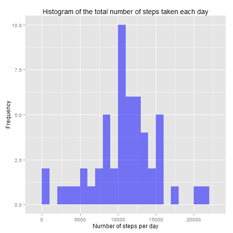
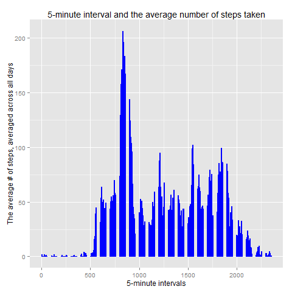
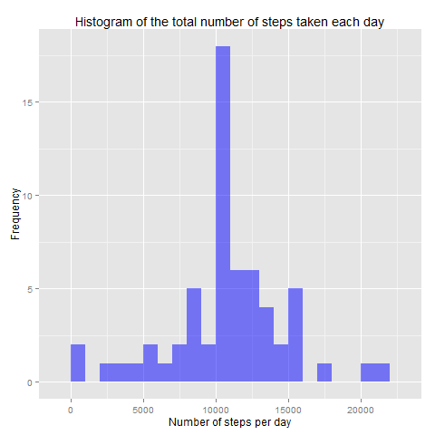
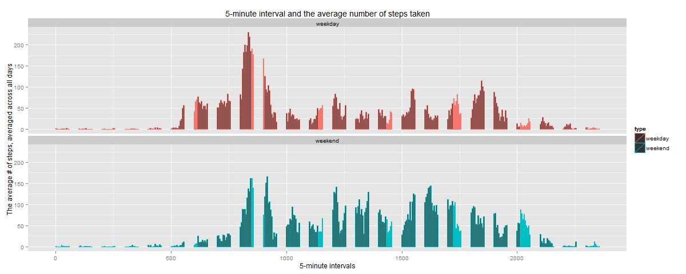
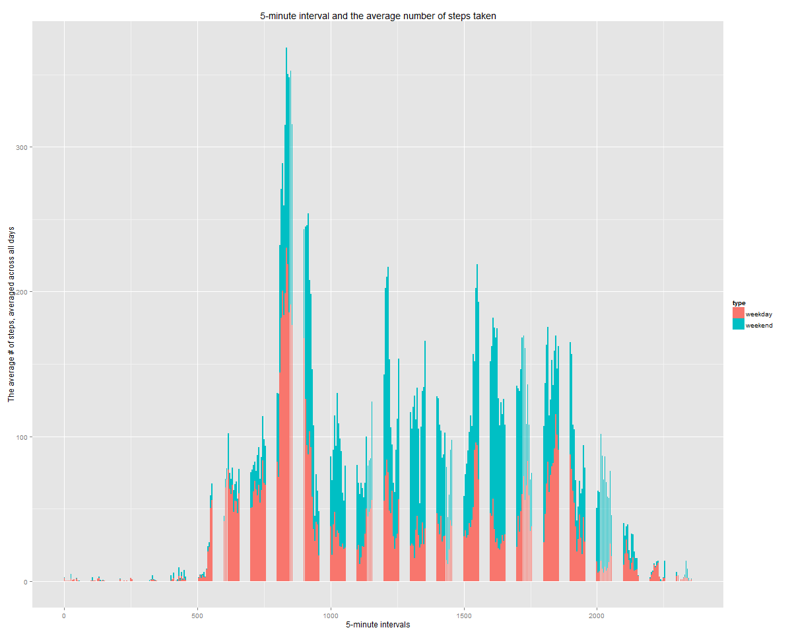

# Reproducible Research: Peer Assessment 1

**Student** Sergiy Redchyts

# Introduction

This document presents the results of peer assessments 1 of course Reproducible Research on coursera. This assignment makes use of data from a personal activity monitoring device. This device collects data at 5 minute intervals through out the day. The data consists of two months of data from an anonymous individual collected during the months of October and November, 2012 and include the number of steps taken in 5 minute intervals each day.

This document presents the results of the Reproducible Research's Peer Assessment 1 in a report using a single R markdown document that can be processed by knitr and be transformed into an HTML file.
Through this report you can see that activities on weekdays mostly follow a work related routine, where we find some more intensity activity in little a free time that the employ can made some sport.

An important consideration is the fact of our data presents as a t-student distribution (see both histograms), it means that the impact of imputing missing values with the mean has a good impact on our predictions without a significant distortion in the distribution of the data.

## R environment set up

Set up *echo* equal a **TRUE** and *results* equal a **hold** as global options for this project.

```r
library(knitr)
opts_chunk$set(echo = TRUE, results = 'hold')
```

Loading all required libraries

```r
library(lubridate) # to work with dates
library(data.table) # to process data tables
library(ggplot2) # to build plots
library(dplyr) # to manipulate data
```

## Loading and preprocessing the data

The data for this assignment were downloaded from the course web site:

* Dataset: [Activity monitoring data](https://d396qusza40orc.cloudfront.net/repdata%2Fdata%2Factivity.zip) [52K]

The variables included in this dataset are:

* **steps**: Number of steps taking in a 5-minute interval (missing values are coded as `NA`)

* **date**: The date on which the measurement was taken in YYYY-MM-DD format

* **interval**: Identifier for the 5-minute interval in which measurement was taken

The dataset is stored in a comma-separated-value (CSV) file and there are a total of 17,568 observations in this dataset.

Loading the data:

```r
unzip(zipfile="activity.zip")  
data <- read.csv("activity.csv", header = TRUE, sep = ",", colClasses=c("numeric", "character", "numeric")) 
```
Initial data preprocessing:

```r
data$date <- ymd(data$date) # to convert string into POSIXct date format 
```

## What is mean total number of steps taken per day?

For this part of the assignment, we ignore the missing values in the dataset.

Aggregating the total steps per day into the new data set:

```r
total_steps_per_day <- aggregate(steps~date, data, sum)
```

1. Making a histogram of the total number of steps taken each day

```r
ggplot(total_steps_per_day, aes(x = steps)) + 
        geom_histogram(fill = "blue", binwidth = 1000, alpha = 0.5) + 
        labs(title="Histogram of the total number of steps taken each day", 
               x = "Number of steps per day", 
               y = "Frequency") + 
        theme_grey()
```

 

2. Calculating the **mean** and **median** total number of steps taken per day

```r
mean_steps   <- mean(total_steps_per_day$steps)
median_steps <- median(total_steps_per_day$steps)
```

**Mean** steps = **10766**  
**Median** steps = **10765**


## What is the average daily activity pattern?

Aggregating number of steps by 5-minutes intervals:

```r
steps_per_5min <- aggregate(steps~interval, data, mean, na.rm=TRUE)
```

1. Making a bar plot of the 5-minute interval (x-axis) and the average number of steps taken, averaged across all days (y-axis):

```r
ggplot(steps_per_5min, aes(x = interval, y = steps)) + 
        geom_bar(stat="identity", color="blue") + 
        labs(title="5-minute interval and the average number of steps taken", 
             x = "5-minute intervals", 
             y = "The average # of steps, averaged across all days")
```     

         


2. Defining which 5-minute interval, on average across all the days in the dataset, contains the maximum number of steps?

```r
print("Next 5-minute interval, on average across all the days in the dataset, contains the maximum number of steps:")
print(steps_per_5min[which.max(steps_per_5min$steps),])
```

**Result**: **interval** - 835, **max # of steps** - 206

## Imputing missing values

There are a number of days/intervals where there are missing values (coded as NA). 
The presence of missing days may introduce bias into some calculations or summaries of the data.

1. Calculating and reporting the total number of missing values in the dataset (i.e. the total number of rows with NAs)

```r
na_values <- sum(is.na(data$steps))
```

The total number of missing values are **2304**.

2. Devising a strategy for filling in all of the missing values in the dataset.

Replacing of all the mising values in dataset with the mean value at the same interval across days.

```r
data1 <- data # make a copy of data set
na_ind <- which(is.na(data1$steps)) # identify all records with NA value of steps
for (ind in na_ind) data1$steps[ind] <- as.integer(round(steps_per_5min$steps[which(steps_per_5min$interval==data1$interval[ind])])) # replace all NA values with the mean value at the same interval across days
```

3. Create a new dataset that is equal to the original dataset but with the missing data filled in.

**data1** is the dataset that is equal to the original dataset **data** but with the missing data filled in

4. Making a histogram of the total number of steps taken each day

```r
total_steps_per_day_replaced <- aggregate(steps~date, data1, sum)
ggplot(total_steps_per_day_replaced, aes(x = steps)) + 
        geom_histogram(fill = "blue", binwidth = 1000, alpha = 0.5) + 
        labs(title="Histogram of the total number of steps taken each day", 
               x = "Number of steps per day", 
               y = "Frequency") + 
        theme_grey()
```



Calculating the mean and median total number of steps taken per day.

```r
mean_steps_replaced   <- mean(total_steps_per_day_replaced$steps)
median_steps_replaced <- median(total_steps_per_day_replaced$steps)
```

**Mean** steps replaced = **10766**  
**Median** steps replaced = **10762**

Do these values differ from the estimates from the first part of the assignment?
What is the impact of imputing missing data on the estimates of the total daily number of steps?

Mean value is almoust the same, but median value is lower after inputing missing data. The reason is that many absent values were replaced by 0's, so the median gone down.

## Are there differences in activity patterns between weekdays and weekends?

For this part we will use the wday() function and the dataset with the filled-in missing values (*data1*).

1. Creating a new factor variable in the dataset with two levels – “weekday” and “weekend” indicating whether a given date is a weekday or weekend day.

```r
data1 <- mutate(data1, day = wday(date)) # add day number as a new variable
data1 <- mutate(data1, type = as.factor(ifelse((day %in% c(7,1)), "weekend", "weekday"))) # converting day number to day type
```

2. Making a panel plot containing a time series plot of the 5-minute interval (x-axis) and the average number of steps taken, averaged across all weekday days or weekend days (y-axis):

```r
# aggregating data set by interval and type with steps number mean
steps_per_5min_weekdays <- data1 %>%
        group_by(interval, type) %>%
        summarise(steps = mean(steps))

```

  

Also both plots could be displayed on the same panel for more easy analysis:

```r
ggplot(steps_per_5min_weekdays, aes(x = interval, y = steps, fill = type)) + 
        geom_bar(stat="identity") + 
        labs(title="5-minute interval and the average number of steps taken", 
             x = "5-minute intervals", 
             y = "The average # of steps, averaged across all days")
```

  
